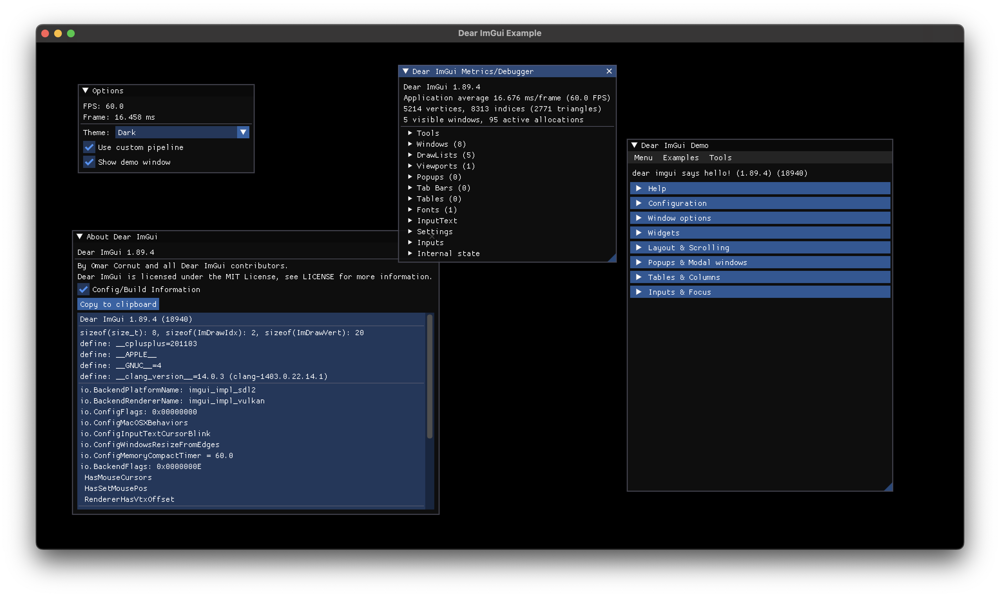

# Dear ImGui Example

This example showcases how to integrate the Dear ImGui library using Grace.
It also demonstrates how to use a custom pipeline to render the primitives generated by Dear ImGui.

